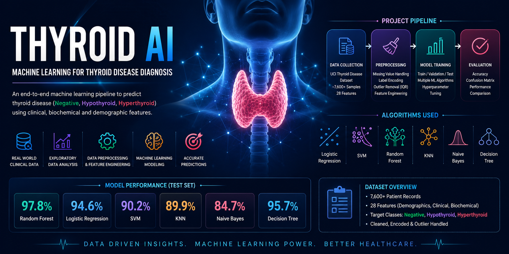

# 🧠 Thyroid Disease Classification using Machine Learning


<p align="center">
  
</p>
---

## 📌 Overview

This project builds a **machine learning pipeline for thyroid disease classification** using clinical patient data.

The system predicts one of three conditions:

- ✅ Negative (No disease)
- ⚠️ Hyperthyroid
- ⚠️ Hypothyroid

The goal is to assist early detection using data-driven models.

---

## 📂 Dataset Description

The dataset contains patient medical records with features such as:

- Age
- TSH, T3, TT4, T4U, FTI laboratory results
- Clinical indicators
- Referral source
- Target diagnosis label

---

## 🧹 Data Preprocessing

The following preprocessing steps were applied:

### 🔹 Missing Values Handling
- Constant imputation (`fill_value = 0`)
- Categorical imputation using most frequent values

### 🔹 Encoding
- Label encoding for categorical features
- One-hot encoding for `referral_source`

### 🔹 Feature Cleaning
- Removal of redundant measurement flags
- Dropping irrelevant identifiers

---

## 🧠 Machine Learning Models

The following models were trained and compared:

- Logistic Regression
- Support Vector Machine (SVM)
- Random Forest Classifier
- Gradient Boosting Classifier

---

## 📊 Model Evaluation

Models are evaluated using:

- Accuracy Score
- Precision / Recall / F1-score
- Confusion Matrix
- ROC-AUC Curve

---

## 🏆 Best Model Performance

| Model              | Accuracy |
|-------------------|----------|
| Logistic Regression | ~93%     |
| SVM                | ~89%     |
| Random Forest      | **~94%** |
| Gradient Boosting  | ~92%     |

👉 Random Forest performed best overall.

---

## 📉 Example Outputs

### Confusion Matrix


### Class Distribution


### ROC Curve


---

## 🧪 Feature Engineering

Feature selection was performed using:

- Recursive Feature Elimination (RFE)
- Random Forest Importance
- Mutual Information

Top predictive features include:
- TSH levels
- TT4 / FTI values
- Age-related indicators

---

## 🚀 How to Run

### 1️⃣ Install dependencies
```bash
pip install -r requirements.txt
